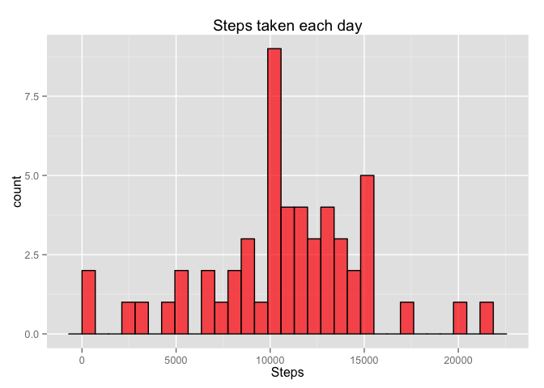
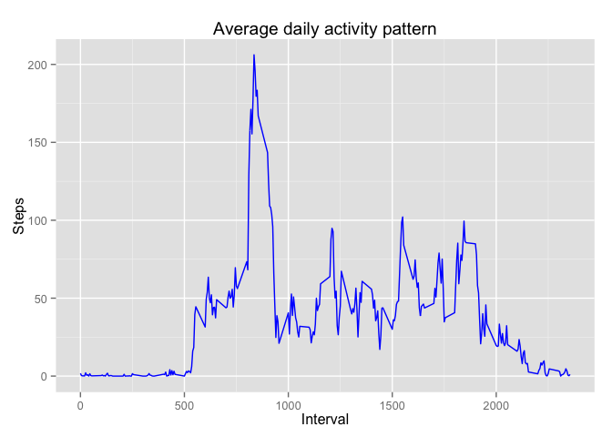
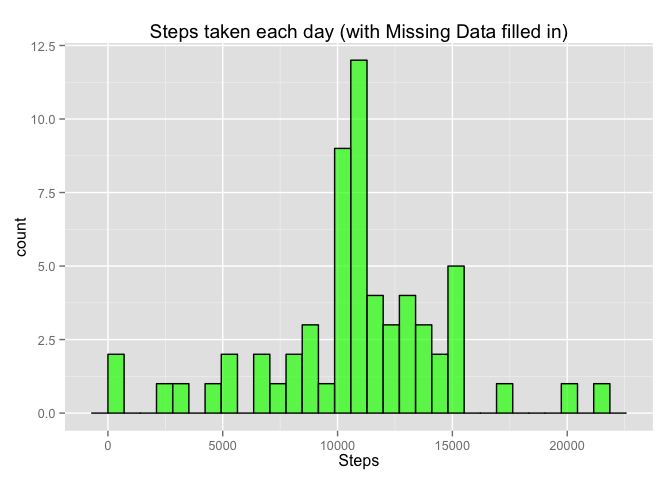
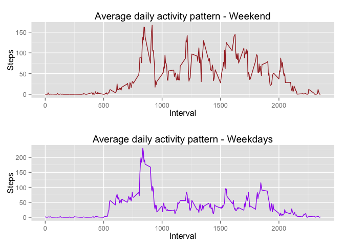

# Reproducible Research: Peer Assessment 1
Daniele Pigni  
14 May 2015  

## Introduction

The key purpose of this assignment is to generate a Rmd file as an example of reproducible research. All the data management, elaboration and plotting are made on a file containing personal activity monitoring device.

## Loading and preprocessing the data
Show any code that is needed to  

- Load the data
- Process/transform the data into a format suitable for your analysis


### Load required libraries
The only packages needed for this assignment are ggplot2 and gridExtra, both used for plotting. For the remaining data management I've used the default packages.

```r
require(ggplot2)
```

```
## Loading required package: ggplot2
```

```r
require(gridExtra)
```

```
## Loading required package: gridExtra
## Loading required package: grid
```

### Load and preprocess data  
Output: Activity data.frame, Activity.no.na data.frame

```r
Activity <- as.data.frame(read.csv(unz("activity.zip",
                                       "activity.csv")))
Activity$date <- as.Date(Activity$date)
Activity.no.na <- Activity[complete.cases(Activity),]
```

## What is mean total number of steps taken per day?
For this part of the assignment, you can ignore the missing values in the dataset.

- Calculate the total number of steps taken per day
- Make a histogram of the total number of steps taken each day
- Calculate and report the mean and median of the total number of steps taken per day


### Calculate total number of steps taken per day
Output: stepsXday data.frame

```r
stepsXday <- as.data.frame(tapply(Activity.no.na$steps, 
                                  Activity.no.na$date, sum))
stepsXday$Date <- as.Date(rownames(stepsXday))
colnames(stepsXday) <- c("Steps","Date")
rownames(stepsXday) <- NULL
```

### Histogram displaying the number of steps taken each day

```r
chart1 <- ggplot(stepsXday,aes(Steps)) + 
    geom_histogram(fill="red",alpha=0.7,col="black") + 
    ggtitle("Steps taken each day")
chart1
```

 

Total mean and median

```r
mean(stepsXday$Steps)
```

```
## [1] 10766.19
```

```r
median(stepsXday$Steps)
```

```
## [1] 10765
```

## What is the average daily activity pattern?
- Make a time series plot of the 5-minute interval (x-axis) and the average number of steps taken, averaged across all days (y-axis)
- Which 5-minute interval, on average across all the days in the dataset, contains the maximum number of steps?

### Calculate mean of steps taken per interval

```r
stepsXinterval <- as.data.frame(tapply(Activity.no.na$steps, 
                                  Activity.no.na$interval, mean))
stepsXinterval$Interval <- as.integer(rownames(stepsXinterval))
colnames(stepsXinterval) <- c("Steps","Interval")
rownames(stepsXinterval) <- NULL
```

### Display time series plot of the 5-minute interval and average steps

```r
chart2 <- ggplot(stepsXinterval, aes(Interval,Steps)) + 
    geom_line(col="blue") + 
    ggtitle("Average daily activity pattern")
chart2 
```

 

Which 5-minute interval, on average across all the days in the dataset, contains the maximum number of steps?

Output: MaxInterval data.frame

```r
MaxSteps <- max(stepsXinterval$Steps)
Index <- match (MaxSteps, stepsXinterval$Steps)
MaxInterval <- as.data.frame(stepsXinterval$Steps[Index])
colnames(MaxInterval) <- "Average steps"
MaxInterval$Interval <- rownames(MaxInterval)
rownames(MaxInterval) <- NULL
MaxInterval
```

```
##   Average steps Interval
## 1      206.1698      835
```

## Imputing missing values
- Calculate and report the total number of missing values in the dataset
- Devise a strategy for filling in all of the missing values in the dataset. 
- Create a new dataset that is equal to the original dataset but with the missing data filled in.
- Make a histogram of the total number of steps taken each day and Calculate and report the mean and median total number of steps taken per day. 
- Do these values differ from the estimates from the first part of the assignment? What is the impact of imputing missing data on the estimates of the total daily number of steps?

### Calculate and report the total number of missing values in the dataset

```r
sum(is.na(Activity$steps))
```

```
## [1] 2304
```

### Devise a strategy for fillin in all of the missing values in the dataset
I'll fill all the missing values with the average of that specific interval.

Output: MD.Activity data.frame

```r
MD.Activity <- Activity
MD.Activity$steps[is.na(MD.Activity$steps)] <- stepsXinterval[
    match(MD.Activity$interval,stepsXinterval$Interval),1]
```

```
## Warning in MD.Activity$steps[is.na(MD.Activity$steps)] <-
## stepsXinterval[match(MD.Activity$interval, : number of items to replace is
## not a multiple of replacement length
```

### Make a histogram of the total number of steps taken each day and Calculate and report the mean and median total number of steps taken per day

Calculate total number of steps taken per day  
Output: MD.stepsXday data.frame 

```r
MD.stepsXday <- as.data.frame(tapply(MD.Activity$steps, 
                                  MD.Activity$date, sum))
MD.stepsXday$Date <- as.Date(rownames(MD.stepsXday))
colnames(MD.stepsXday) <- c("Steps","Date")
rownames(MD.stepsXday) <- NULL
```

Histogram on the number of steps taken each day

```r
chart3 <- ggplot(MD.stepsXday,aes(Steps)) + 
    geom_histogram(col="black", fill="green" , alpha = 0.7) +
    ggtitle("Steps taken each day (with Missing Data filled in)")
chart3
```

 

Calculate mean and median

```r
mean(MD.stepsXday$Steps)
```

```
## [1] 10766.19
```

```r
median(MD.stepsXday$Steps)
```

```
## [1] 10766.19
```

The difference of values is minimal, mean is the same while median is slightly bigger from previous estimates.  
Looking at the histograms, frequency in the second chart is higher as expected because of the new values filling in missing data. The shape of the two histograms is similar but not identical.  
The impact of imputing missing data is visible but not drastic.

## Are there differences in activity patterns between weekdays and weekends?
- Create a new factor variable in the dataset with two levels – “weekday” and “weekend” indicating whether a given date is a weekday or weekend day.
- Make a panel plot containing a time series plot of the 5-minute interval (x-axis) and the average number of steps taken, averaged across all weekday days or weekend days (y-axis)

### Create a new factor variable in the dataset with two levels - "weekday" and "weekend"

Output: MD.Activity$day Factor

```r
day <- weekdays(MD.Activity$date, abbreviate = T)
day <- MD.Activity$day <- as.factor(ifelse(day == "Sat" | day == "Sun","weekend","weekday"))
WD.WE <- split(MD.Activity, day)
```

### Make a panel plot containing a time series plot of the 5-minute interval (x-axis) and the average number of steps taken, averaged across all weekday days or weekend days (y-axis)

Calculate average steps per interval weekdays/weekends  
Output: stepsXintervalWeekday data.frame, stepsXintervalWeekend data.frame

```r
stepsXintervalWeekend <- as.data.frame(tapply(WD.WE$weekend$steps, 
                                  WD.WE$weekend$interval, mean))
stepsXintervalWeekday <- as.data.frame(tapply(WD.WE$weekday$steps, 
                                  WD.WE$weekday$interval, mean))
stepsXintervalWeekend$Interval <- as.integer(rownames(stepsXintervalWeekend))
stepsXintervalWeekday$Interval <- as.integer(rownames(stepsXintervalWeekday))
colnames(stepsXintervalWeekend) <- c("Steps","Interval")
rownames(stepsXintervalWeekend) <- NULL
colnames(stepsXintervalWeekday) <- c("Steps","Interval")
rownames(stepsXintervalWeekday) <- NULL
```

Panel plot

```r
chart4 <- ggplot(stepsXintervalWeekend, aes(Interval,Steps)) + geom_line(col = "brown") + ggtitle("Average daily activity pattern - Weekend")
chart5 <- ggplot(stepsXintervalWeekday, aes(Interval,Steps)) + geom_line(col = "purple") + ggtitle("Average daily activity pattern - Weekdays")
grid.arrange(chart4, chart5, nrow=2)
```

 
